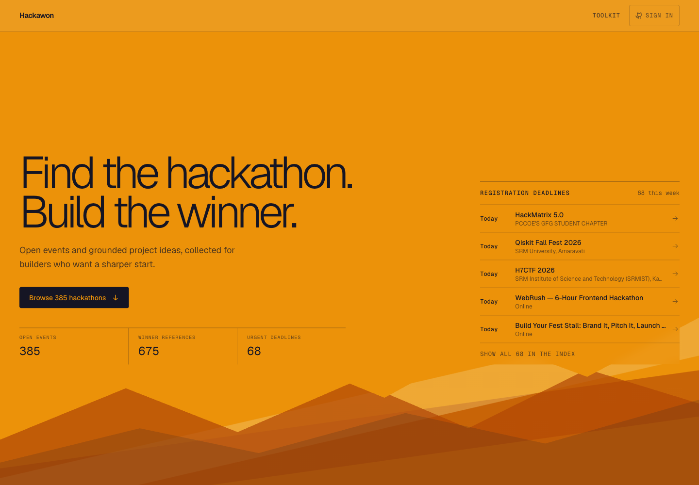
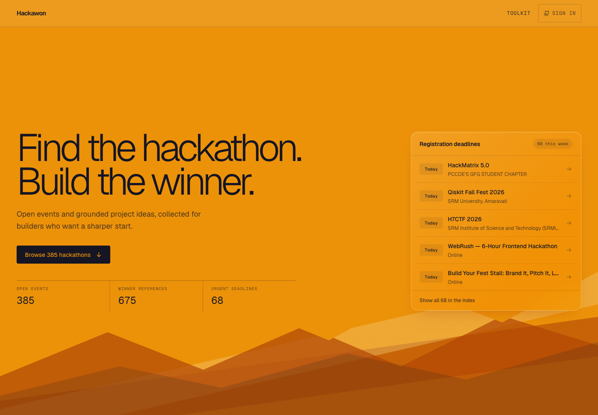

# UI verification — 2026-09-27

The Registration deadlines panel now has an amber glass surface, a restrained highlight border,
consistent padding, aligned day badges and softer row dividers. It retains the existing palette
in light and dark mode and shows three rows on small screens, five on desktop.

Playwright found one existing functional defect: browser Forward restored a detail URL without
reopening its sheet. The history handler now selects the event from the stored slug. The
regression check failed before the fix and passed afterward.

## Production-preview checks

All 11 Playwright check groups passed in an isolated browser context:

- Search, empty results and clearing filters.
- All four imported source filters; external discovery URLs and separate-tab link attributes.
- Mode, topic and geography filters.
- Saving, reload persistence, saved filtering and removal.
- Deadline shortcut filtering.
- Deadline detail sheets, loaded ideas, prompt copying, Escape, Close, Back and Forward.
- Static event URLs, reloading, expanding the prompt and return navigation.
- Toolkit navigation, outgoing link attributes and return navigation.
- 390px mobile, 768px tablet and 1440px desktop layouts in both themes; no horizontal overflow.
- Loading skeletons, no-deadline state, a simulated 503 and successful reload recovery.
- No uncaught browser errors in the completed flows.

All 385 preview detail pages and all advertised idea files exist. The preview uses the existing
local bundle plus one live Hack2Skill record exported to a temporary directory. Stored source
data was not modified by these UI checks.

`make check` passed: 177 backend tests, 68 frontend tests, Ruff and TypeScript.
The frontend production build and prerender completed successfully.

GitHub OAuth and account sync were not exercised against a real account: authentication is not
configured in the local build, and its Sign in control is correctly disabled. External platform
registration flows were not exercised; discovery and Apply link destinations were checked.

## Visual review

Before:

After:

[Dark theme](screenshots/registration-deadlines-dark.png) ·
[Mobile layout](screenshots/registration-deadlines-mobile.png)

No production deployment was performed.
